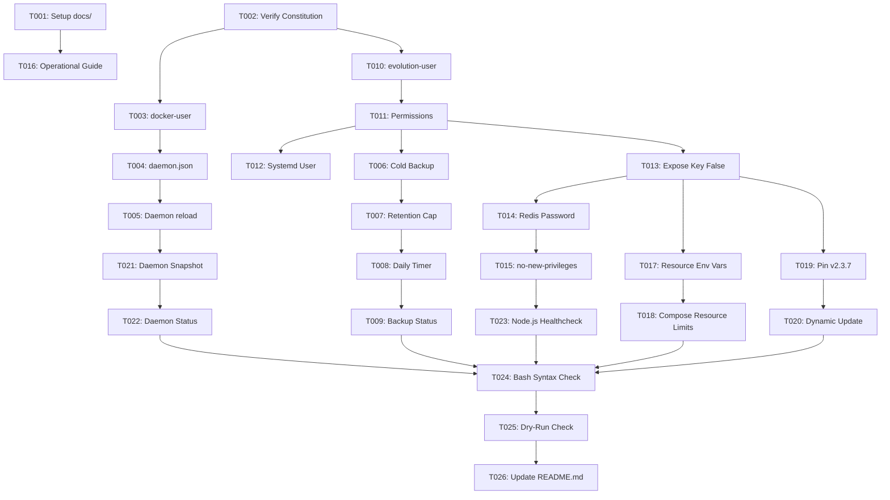

# Tasks: Docker & Evolution API Hardening & Resource Optimization

**Input**: Design documents from `specs/001-docker-evolution-hardening/`  
**Prerequisites**: [plan.md](./plan.md) (required), [spec.md](./spec.md) (required for user stories), [research.md](./research.md), [data-model.md](./data-model.md), [quickstart.md](./quickstart.md)

---

## Format: `[ID] [P?] [Story] Description with file path`

- **[P]**: Can run in parallel (different files, no dependencies)
- **[Story]**: Which user story this task belongs to (e.g., [US1], [US2], [US3]...)
- All descriptions include explicit file paths

---

## Phase 1: Setup (Shared Infrastructure)

**Purpose**: Initialize documentation directories and governance baseline

- [X] T001 Create `docs/` directory for operational guides in repository root
- [X] T002 [P] Verify constitution principles and isolated service users rule in `.specify/memory/constitution.md`

---

## Phase 2: Foundational (Docker Daemon & Service User Infrastructure)

**Purpose**: Core infrastructure that must be complete before service stack customizations

- [X] T003 [P] Implement `docker-user` unprivileged system account provisioning in `service-docker`
- [X] T004 Implement idempotent `/etc/docker/daemon.json` configuration manager (`live-restore: true`, log rotation `20m`/`3`, `userland-proxy: false`) with backup in `service-docker`
- [X] T005 Add daemon configuration reload and live-restore validation in `service-docker`

**Checkpoint**: Docker daemon baseline hardened with live-restore and log limits; `docker-user` ready.

---

## Phase 3: User Story 1 - Automated Daily Volume Backups, Cold Backup & Retention Policy (Priority: P1) 🎯 MVP

**Goal**: Deliver fully automated daily backups at 03:00, supporting cold backups when PostgreSQL is offline, and strictly enforcing a 10-archive retention cap.

**Independent Test**:
Execute backup routine with PostgreSQL online and offline; generate 11+ backups and verify that at most 10 archive files remain in `/opt/evolution-api/backups/`.

- [X] T006 [US1] Update `create_backup()` in `service-evolution-api` to detect PostgreSQL container state and execute cold volume backup via ephemeral `alpine` container when database is stopped
- [X] T007 [US1] Implement 10-archive retention policy in `create_backup()` in `service-evolution-api` to automatically prune archives beyond the 10 newest in `/opt/evolution-api/backups/`
- [X] T008 [US1] Implement automated daily backup systemd timer and service (`evolution-api-backup.timer` and `evolution-api-backup.service` at 03:00 daily, with `/etc/cron.daily` fallback) in `service-evolution-api`
- [X] T009 [US1] Add backup status diagnostics in `action_status()` in `service-evolution-api` reporting timer status and total archive count

**Checkpoint**: Automated daily backups operational, cold backups verified, 10-archive cap strictly enforced.

---

## Phase 4: User Story 2 - Security Hardening & Unprivileged Service User Isolation (Priority: P1)

**Goal**: Isolate service runtime and files under dedicated unprivileged `evolution-user`, eliminate credential leaks in API responses, and protect Redis credentials.

**Independent Test**:
Verify `evolution-user` ownership of `/opt/evolution-api`, confirm systemd unit executes under `User=evolution-user`, verify `/instance/fetchInstances` returns no instance keys, and verify `ps aux` hides Redis passwords.

- [X] T010 [US2] Implement unprivileged system user `evolution-user` (`useradd -r -s /usr/sbin/nologin -d /opt/evolution-api -M`) and `docker` group membership in `service-evolution-api`
- [X] T011 [US2] Update directory creation and permissions in `service-evolution-api` (`chmod 750 /opt/evolution-api`, `chmod 600 /opt/evolution-api/.env`, ownership `evolution-user:evolution-user`)
- [X] T012 [US2] Update `/etc/systemd/system/evolution-api.service` generator in `service-evolution-api` to execute under `User=evolution-user` and `Group=evolution-user`
- [X] T013 [US2] Set `AUTHENTICATION_EXPOSE_IN_FETCH_INSTANCES=false` in `.env` generator inside `service-evolution-api`
- [X] T014 [US2] Remove Redis password from `command: ["redis-server", ...]` in `docker-compose.yml` to prevent plaintext leakage into Linux process table (`ps aux`) in `service-evolution-api`
- [X] T015 [US2] Add `security_opt: [no-new-privileges:true]` across all services in `docker-compose.yml` in `service-evolution-api`

**Checkpoint**: Full least-privilege security hardening active; root execution and credential leaks eliminated.

---

## Phase 5: User Story 3 - Parametrized Resource Optimization & Monitoring Guide (Priority: P2)

**Goal**: Parameterize memory/CPU allocations tuned for ~10 WhatsApp instances and deliver comprehensive sizing and live monitoring documentation.

**Independent Test**:
Verify `.env` exposes resource variables, verify `docker-compose.yml` applies soft reservations and hard limits, and review `docs/resource-tuning-and-monitoring.md`.

- [X] T016 [P] [US3] Create operational sizing and live monitoring guide in `docs/resource-tuning-and-monitoring.md`
- [X] T017 [US3] Add resource variables (`EVOLUTION_MEM_LIMIT=2048m`, `EVOLUTION_MEM_RESERVE=512m`, `EVOLUTION_CPUS=1.5`, etc.) to default `.env` generator in `service-evolution-api`
- [X] T018 [US3] Wire resource limits and reservations into `docker-compose.yml` services in `service-evolution-api`

**Checkpoint**: Stack resource limits applied; operations documentation available.

---

## Phase 6: User Story 4 - Version Determinism (v2.3.7) & Safe Update Path (Priority: P2)

**Goal**: Pin default installation to stable version 2.3.7 and implement dynamic latest-release discovery during `--update`.

**Independent Test**:
Run clean install to verify image is `evoapicloud/evolution-api:v2.3.7`; execute update routine to verify latest release discovery and verification.

- [X] T019 [US4] Pin default installation image to `evoapicloud/evolution-api:v2.3.7` in `service-evolution-api`
- [X] T020 [US4] Implement dynamic latest release discovery (Docker Hub API query with fallback) in `action_update()` in `service-evolution-api`

**Checkpoint**: Version determinism guaranteed on fresh installs; update path automatically fetches latest stable release.

---

## Phase 7: User Story 5 - Docker Daemon Baseline Hardening (Priority: P2)

**Goal**: Integrate daemon diagnostic visibility and state reporting in Docker tooling.

**Independent Test**:
Run `service-docker --status` and confirm `daemon.json` path, `live-restore` state, and log driver options are clearly displayed.

- [X] T021 [US5] Implement pre-flight and pre-update snapshot logging of daemon status and live-restore state in `service-docker`
- [X] T022 [US5] Add daemon configuration status and live-restore verification in `action_status()` in `service-docker`

**Checkpoint**: Docker daemon status and live-restore diagnostics fully integrated into CLI reporting.

---

## Phase 8: User Story 6 - Resilient In-Container Healthcheck (Priority: P3)

**Goal**: Ensure `evolution_api` container accurately reports `healthy` status without relying on external `curl` binary.

**Independent Test**:
Inspect container health status with `docker inspect --format '{{.State.Health.Status}}' evolution_api` and confirm exit code 0.

- [X] T023 [US6] Replace `curl` healthcheck in `docker-compose.yml` with native Node.js HTTP evaluation (`node -e "..."`) in `service-evolution-api`

**Checkpoint**: Evolution API container reliably reports `healthy` without missing binary errors.

---

## Phase 9: Polish & Cross-Cutting Concerns

**Purpose**: Syntax validation, CLI sanity checks, and master documentation updates

- [X] T024 Validate bash script syntax across `service-docker` and `service-evolution-api` using `bash -n`
- [X] T025 Verify dry-run diagnostics mode (`service-docker -c` and `service-evolution-api -c`)
- [X] T026 Update `README.md` documenting new security parameters, isolated system users, and tuning guides

---

## Dependencies & Execution Order

---

## Parallel Execution Opportunities

- **T003 (docker-user)** and **T010 (evolution-user)** can be developed in parallel as they touch separate service files (`service-docker` and `service-evolution-api`).
- **T016 (Operational Guide in `docs/`)** can be authored in parallel with script coding.
- **T004 (daemon.json in `service-docker`)** and **T006/T007 (backups in `service-evolution-api`)** can be implemented concurrently.

---

## Implementation Strategy & MVP Scope

1. **MVP Scope (Phase 1 to Phase 3)**:
   - Hardened `daemon.json` + `docker-user`.
   - Automated daily backup with cold backup support and 10-archive retention.
2. **Increment 2 (Phase 4 & Phase 8)**:
   - `evolution-user` system account and permissions.
   - `AUTHENTICATION_EXPOSE_IN_FETCH_INSTANCES=false`.
   - Redis secret shielding and Node.js healthcheck fix.
3. **Increment 3 (Phase 5 to Phase 7)**:
   - Resource limits tuned for ~10 instances and operational markdown guide.
   - Default image pinned to `v2.3.7` with dynamic `--update` discovery.
4. **Final Polish (Phase 9)**:
   - Syntax validation, dry-run testing, and `README.md` updates.
