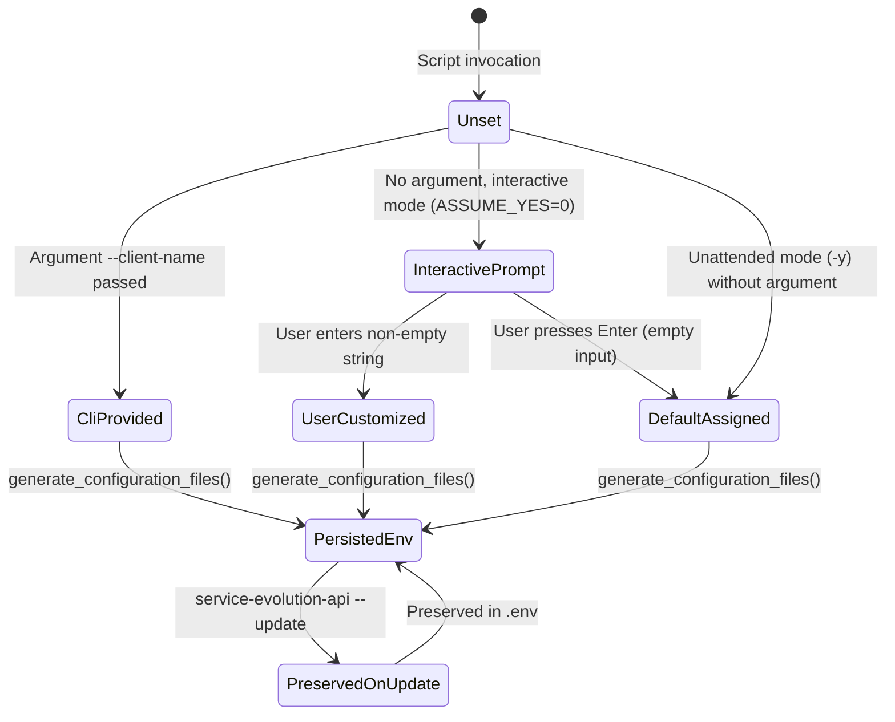

# Data Model: Dynamic WhatsApp Session Client Name Configuration

**Feature**: Dynamic WhatsApp Session Client Name Configuration  
**Branch**: `002-evolution-client-name`  
**Date**: 2026-09-22  

---

## Configuration Schema

### 1. Variable: `CONFIG_SESSION_PHONE_CLIENT`

| Attribute | Specification |
| :--- | :--- |
| **Variable Name** | `CONFIG_SESSION_PHONE_CLIENT` |
| **Type** | String (UTF-8) |
| **Default Value** | `"Inova Evolution API"` |
| **Allowed Length** | 1 to 64 characters |
| **CLI Argument** | `--client-name <name>` or `--client-name=<name>` |
| **Target Storage** | `${INSTALL_DIR}/.env` and `${INSTALL_DIR}/docker-compose.yml` |
| **Scope** | Global default client label for all WhatsApp sessions initiated by this Evolution API instance |

---

## Lifecycle State Transitions

