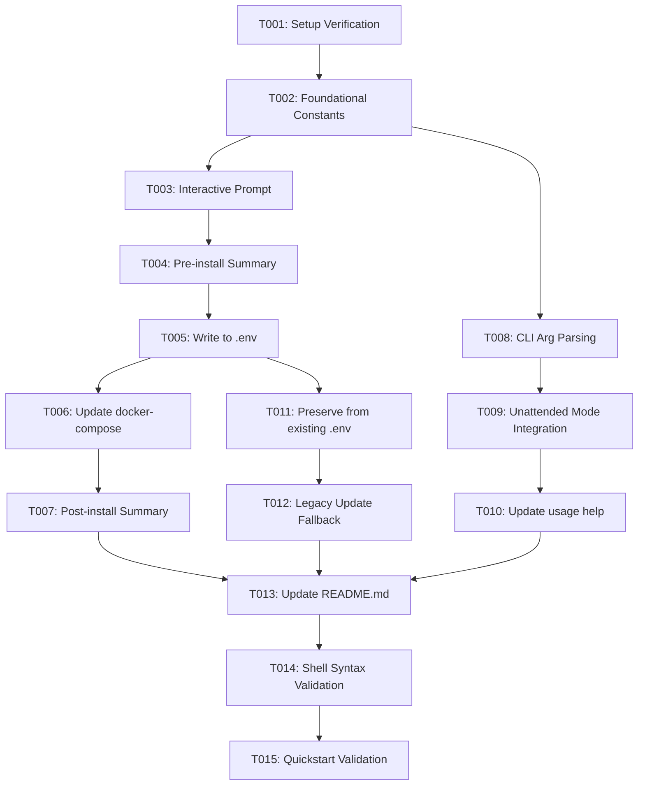

# Tasks: Dynamic WhatsApp Session Client Name Configuration

**Input**: Design documents from `specs/002-evolution-client-name/`  
**Prerequisites**: plan.md (required), spec.md (required for user stories), research.md, data-model.md, quickstart.md  
**Tests**: Automated tests not requested; validation performed via shell syntax checks (`bash -n`) and CLI execution scenarios.  
**Organization**: Tasks are grouped by user story to enable independent implementation and testing of each story.

## Format: `[ID] [P?] [Story] Description`

- **[P]**: Can run in parallel (different files, no dependencies)
- **[Story]**: Which user story this task belongs to (e.g., US1, US2, US3)
- Exact file paths included in all descriptions

---

## Phase 1: Setup (Shared Infrastructure)

**Purpose**: Baseline preparation and variable declarations

- [x] T001 Verify baseline script integrity and review existing configuration templates in `service-evolution-api`

---

## Phase 2: Foundational (Blocking Prerequisites)

**Purpose**: Core constants and variable definitions that MUST be complete before ANY user story can be implemented

**⚠️ CRITICAL**: No user story work can begin until this phase is complete

- [x] T002 Declare `DEFAULT_SESSION_PHONE_CLIENT="Inova Evolution API"` and initialize `CONFIG_SESSION_PHONE_CLIENT=""` in default configuration section of `service-evolution-api`

**Checkpoint**: Foundation ready - user story implementation can now begin

---

## Phase 3: User Story 1 - Interactive Customization of WhatsApp Session Client Name on Install (Priority: P1) 🎯 MVP

**Goal**: Prompt operator during interactive installation for the session client name with default "Inova Evolution API", saving it to `.env` and `docker-compose.yml`.

**Independent Test**:
Run `./service-evolution-api` interactively (without `-y`), enter a custom client name (e.g. `Minha Empresa Atendimento`), complete installation, and verify that the generated `/opt/evolution-api/.env` and `docker-compose.yml` contain `CONFIG_SESSION_PHONE_CLIENT=Minha Empresa Atendimento`.

### Implementation for User Story 1

- [x] T003 [US1] Add interactive prompt for WhatsApp Session Client Name using `prompt_value` in `main_install()` of `service-evolution-api`
- [x] T004 [US1] Include configured session client name in pre-installation confirmation summary in `service-evolution-api`
- [x] T005 [US1] Update `generate_configuration_files()` in `service-evolution-api` to write dynamic `CONFIG_SESSION_PHONE_CLIENT` into `.env`
- [x] T006 [US1] Update `docker-compose.yml` template in `service-evolution-api` to use dynamic `${CONFIG_SESSION_PHONE_CLIENT}`
- [x] T007 [US1] Display configured session client name in post-installation completion summary in `service-evolution-api`

**Checkpoint**: User Story 1 is fully functional and independently testable as an MVP.

---

## Phase 4: User Story 2 - Non-Interactive Automation via CLI Argument (Priority: P2)

**Goal**: Allow passing `--client-name <name>` or `--client-name=<name>` for automated/unattended setups (`-y`) without blocking.

**Independent Test**:
Run `./service-evolution-api -y --client-name "Automated Support"` in an unattended shell and verify that `/opt/evolution-api/.env` is generated with `CONFIG_SESSION_PHONE_CLIENT=Automated Support` without prompting.

### Implementation for User Story 2

- [x] T008 [US2] Implement `--client-name` and `--client-name=*` argument parsing in CLI options loop of `service-evolution-api`
- [x] T009 [US2] Ensure unattended mode (`-y`) applies `--client-name` value or defaults cleanly to `DEFAULT_SESSION_PHONE_CLIENT` in `service-evolution-api`
- [x] T010 [US2] Document `--client-name` option and its default value in `usage()` help function of `service-evolution-api`

**Checkpoint**: User Stories 1 and 2 work independently for both interactive and automated installations.

---

## Phase 5: User Story 3 - Persistence & Preservation Across Updates and Re-runs (Priority: P2)

**Goal**: Preserve existing `CONFIG_SESSION_PHONE_CLIENT` from `.env` when executing safe updates (`--update`) or re-running installer over an existing installation.

**Independent Test**:
Run `./service-evolution-api --update` on a stack with a customized client name and verify that the resulting `.env` and containers maintain the existing custom client name.

### Implementation for User Story 3

- [x] T011 [US3] Extract and preserve existing `CONFIG_SESSION_PHONE_CLIENT` from `.env` in `generate_configuration_files()` of `service-evolution-api`
- [x] T012 [US3] Ensure safe fallback to `DEFAULT_SESSION_PHONE_CLIENT` if updating legacy installations lacking `CONFIG_SESSION_PHONE_CLIENT` in `service-evolution-api`

**Checkpoint**: Configuration persistence across updates and re-deployments is verified.

---

## Phase 6: Polish & Cross-Cutting Concerns

**Purpose**: Documentation and end-to-end verification

- [x] T013 [P] Document `--client-name` CLI flag and WhatsApp session branding in `README.md`
- [x] T014 Run shell syntax verification (`bash -n service-evolution-api`) to validate script integrity
- [x] T015 Validate verification scenarios defined in `specs/002-evolution-client-name/quickstart.md`

---

## Dependencies & Execution Order

### Phase Dependencies

- **Setup (Phase 1)**: No dependencies - can start immediately.
- **Foundational (Phase 2)**: Depends on Setup (T001) - BLOCKS all user stories.
- **User Story 1 (Phase 3)**: Depends on Foundational (T002). Delivers MVP.
- **User Story 2 (Phase 4)**: Depends on Foundational (T002). Extends CLI parsing.
- **User Story 3 (Phase 5)**: Depends on User Story 1 (T005). Extends `.env` parsing.
- **Polish (Phase 6)**: Depends on completion of all desired user stories.

### User Story Dependencies

- **User Story 1 (P1)**: Core interactive flow and file writing.
- **User Story 2 (P2)**: Independent CLI flags feeding into US1 variable flow.
- **User Story 3 (P2)**: Builds upon US1 file handling to support update scenarios.

---

## Parallel Opportunities

- Within Polish phase:
  - Task T013 (`README.md` documentation) can be worked in parallel with testing tasks.
- Between User Stories:
  - T008-T010 (CLI parsing) can be implemented in parallel with T003-T007 by different contributors.

---

## Implementation Strategy

### MVP First (User Story 1 Only)
1. Complete Phase 1 (Setup) and Phase 2 (Foundational).
2. Implement Phase 3 (User Story 1).
3. **Validate MVP**: Run interactive installation and verify prompt and output in `.env`.

### Incremental Delivery
1. Implement Phase 4 (User Story 2) to unlock CI/CD unattended mode.
2. Implement Phase 5 (User Story 3) to protect existing client names during `--update`.
3. Complete Phase 6 (Polish) for documentation and syntax checks.
