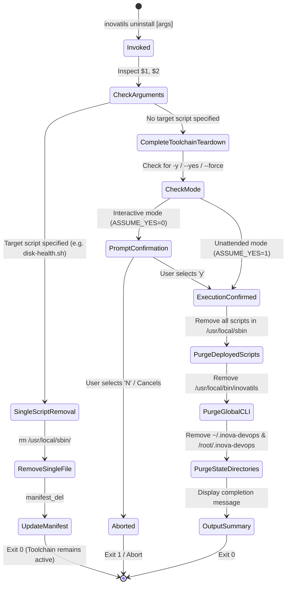

# Data Model: Complete DevOps Utilities Toolchain Uninstallation

**Feature**: Complete DevOps Utilities Toolchain Uninstallation  
**Branch**: `003-inovatils-uninstall`  
**Date**: 2026-10-08  

---

## Component Schema

### 1. Toolchain Components (Subject to Uninstallation)

| Component | Filesystem Location | Description | Permissions / Ownership |
| :--- | :--- | :--- | :--- |
| **Global CLI Wrapper** | `/usr/local/bin/inovatils` | Executable wrapper forwarding commands to manager | `755` (root) |
| **Manager Script** | `${STATE_DIR}/install.sh` | Main script loader, installer, and manager | `750` (user/root) |
| **Manifest** | `${STATE_DIR}/manifest` | Pipe-delimited tracking file (`name\|version\|dir`) | `644` (user/root) |
| **Manager Log** | `${STATE_DIR}/manager.log` | Event log for manager operations | `644` (user/root) |
| **State Directory** | `${HOME}/.inova-devops` / `/root/.inova-devops` | Directory housing manager and state | `750` (user/root) |
| **Deployed Scripts** | `/usr/local/sbin/*.sh`, `/usr/local/sbin/service-*` | Standalone utilities and service managers | `750` (root) |

---

### 2. Operational Workloads (Strictly Preserved)

| Component | Filesystem Location / Scope | Impact of `uninstall` |
| :--- | :--- | :--- |
| **Docker Engine & CLI** | `/usr/bin/docker`, `dockerd`, systemd units | **NONE** (Untouched and running) |
| **Docker Containers** | Running container processes (`docker ps`) | **NONE** (Untouched and running) |
| **Persistent Volumes** | Docker named volumes, `/var/lib/docker/volumes` | **NONE** (Untouched) |
| **Service Configurations** | `/opt/evolution-api/`, `.env`, `docker-compose.yml` | **NONE** (Untouched) |
| **Dedicated System Users** | `evolution-user`, `docker-user`, group memberships | **NONE** (Untouched) |
| **Service Execution Logs** | `/var/log/inova-devops/<service>-*.log` | **NONE** (Untouched) |

---

## Lifecycle State Transitions

