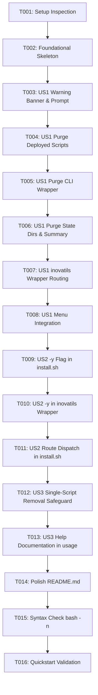

# Tasks: Complete DevOps Utilities Toolchain Uninstallation

**Input**: Design documents from `specs/003-inovatils-uninstall/`  
**Prerequisites**: plan.md (required), spec.md (required for user stories), research.md, data-model.md, contracts/cli-contract.md, quickstart.md  
**Tests**: Automated tests not requested; validation performed via shell syntax checks (`bash -n`) and verification scenarios in `quickstart.md`.  
**Organization**: Tasks are grouped by user story to enable independent implementation and testing of each story.

## Format: `[ID] [P?] [Story] Description`

- **[P]**: Can run in parallel (different files, no dependencies)
- **[Story]**: Which user story this task belongs to (e.g., US1, US2, US3)
- Exact file paths included in all descriptions

---

## Phase 1: Setup (Shared Infrastructure)

**Purpose**: Baseline preparation and inspection of uninstallation entry points

- [x] T001 Review existing uninstallation paths and exit handlers in `install.sh` and `inovatils`

---

## Phase 2: Foundational (Blocking Prerequisites)

**Purpose**: Core toolchain uninstallation function definition that MUST be complete before ANY user story can be implemented

**⚠️ CRITICAL**: No user story work can begin until this phase is complete

- [x] T002 Implement foundational `do_uninstall_toolchain` function skeleton in `install.sh` including sudo/root permission checks, script enumeration, and state directory path resolution (`${STATE_DIR}`, `/home/${SUDO_USER}/.inova-devops`, `/root/.inova-devops`)

**Checkpoint**: Foundation ready - user story implementation can now begin

---

## Phase 3: User Story 1 - Complete Project & CLI Toolchain Uninstallation (Priority: P1) 🎯 MVP

**Goal**: Execute `inovatils uninstall` (and `install.sh uninstall`) interactively to completely remove the global CLI wrapper, all deployed scripts in `/usr/local/sbin`, the manager script, and state directories, while strictly preserving all active services (Docker, Evolution API, containers, volumes, configs, and users).

**Independent Test**:
On a system with `inovatils` and utilities installed alongside Docker/containers, execute `inovatils uninstall`, verify that the banner clearly lists what will be deleted and what is preserved, confirm with `y`, and verify that `/usr/local/bin/inovatils`, `/usr/local/sbin/*`, and `~/.inova-devops` are removed while Docker and containers remain untouched and running.

### Implementation for User Story 1

- [x] T003 [US1] Implement interactive warning banner and confirmation prompt `[y/N]` in `do_uninstall_toolchain()` in `install.sh`, detailing deleted components and explicitly guaranteeing running services remain untouched
- [x] T004 [US1] Implement removal of all deployed utility and service scripts from `/usr/local/sbin/` (using manifest records and available scripts list) in `do_uninstall_toolchain()` in `install.sh`
- [x] T005 [US1] Implement removal of global CLI wrapper `/usr/local/bin/inovatils` in `do_uninstall_toolchain()` in `install.sh`
- [x] T006 [US1] Implement removal of state directories (`${STATE_DIR}`, `/home/${SUDO_USER}/.inova-devops`, `/root/.inova-devops`) and print success/service preservation banner in `install.sh`
- [x] T007 [US1] Update `inovatils` wrapper in `inovatils` to route `uninstall` and `u` without arguments directly to `install.sh` and handle clean self-uninstallation exit
- [x] T008 [US1] Add "Uninstall Inovatils" option to the interactive menus (`arrow_menu` and `gum_menu`) in `install.sh`

**Checkpoint**: User Story 1 is fully functional and independently testable as an MVP.

---

## Phase 4: User Story 2 - Automated Non-Interactive Uninstallation via Flag (Priority: P2)

**Goal**: Allow `inovatils uninstall -y`, `--yes`, or `--force` to perform complete uninstallation without waiting for user input, for automated server provisioning teardown.

**Independent Test**:
Execute `inovatils uninstall -y` in an unattended environment and verify that uninstallation completes with exit code 0 without prompting.

### Implementation for User Story 2

- [x] T009 [US2] Add non-interactive flag handling (`-y`, `--yes`, `--force`) in `do_uninstall_toolchain()` in `install.sh` to bypass interactive confirmation
- [x] T010 [US2] Update argument parsing in `inovatils` to forward `-y`, `--yes`, and `--force` flags directly to `install.sh`
- [x] T011 [US2] Update `u|uninstall|remove|rm` case pattern in `install.sh` to route unattended flags to `do_uninstall_toolchain 1`

**Checkpoint**: User Stories 1 and 2 work independently for interactive and automated teardown.

---

## Phase 5: User Story 3 - Selective Single-Script Removal Preserved (Priority: P3)

**Goal**: Preserve backward-compatible single script removal: `inovatils uninstall <script>` and `inovatils remove <script>` removes only that script from `/usr/local/sbin` and updates the manifest, without deleting `inovatils` or other scripts.

**Independent Test**:
Run `inovatils uninstall disk-health.sh` and verify that only `disk-health.sh` is deleted from `/usr/local/sbin` and manifest, while `inovatils` and `~/.inova-devops` remain active.

### Implementation for User Story 3

- [x] T012 [US3] Ensure `install.sh` command dispatch distinguishes cleanly between complete uninstallation (no script argument or flags) and single-script removal (`do_remove "$2"`) in `install.sh`
- [x] T013 [US3] Update command documentation in `usage()` of `install.sh` and `inovatils` to clearly document `uninstall` (complete teardown) versus `uninstall <script>` (single script removal)

**Checkpoint**: All user stories functional and backward compatibility maintained.

---

## Phase 6: Polish & Cross-Cutting Concerns

**Purpose**: Documentation and end-to-end verification

- [x] T014 [P] Document server setup lifecycle and `inovatils uninstall` command in `README.md`
- [x] T015 Run shell syntax verification (`bash -n inovatils` and `bash -n install.sh`) to validate script integrity
- [x] T016 Validate verification scenarios defined in `specs/003-inovatils-uninstall/quickstart.md`

---

## Dependencies & Execution Order

### Phase Dependencies

- **Setup (Phase 1)**: No dependencies - can start immediately.
- **Foundational (Phase 2)**: Depends on Setup (T001) - BLOCKS all user stories.
- **User Story 1 (Phase 3)**: Depends on Foundational (T002). Delivers MVP.
- **User Story 2 (Phase 4)**: Depends on User Story 1 (T003-T007). Extends flags.
- **User Story 3 (Phase 5)**: Depends on User Story 1 (T007) and Foundational (T002). Preserves single script dispatch.
- **Polish (Phase 6)**: Depends on completion of all user stories.

### User Story Dependencies

- **User Story 1 (P1)**: Core interactive flow and file deletion logic.
- **User Story 2 (P2)**: Extends US1 with non-interactive flag support.
- **User Story 3 (P3)**: Guards existing single-script removal logic against regression.

---

## Implementation Strategy

### MVP First (User Story 1 Only)

1. Complete Phase 1: Setup (T001).
2. Complete Phase 2: Foundational (T002 - blocks all stories).
3. Complete Phase 3: User Story 1 (T003 through T008).
4. **STOP and VALIDATE**: Test `inovatils uninstall` interactively on a test machine or mock environment.
5. Verify that Docker and services remain completely functional.

### Incremental Delivery

1. Complete Setup + Foundational → Core deletion logic ready.
2. Add User Story 1 → Interactive toolchain uninstallation (MVP!).
3. Add User Story 2 → Unattended `-y` support for automated cloud-init pipelines.
4. Add User Story 3 → Single-script removal preservation verified.
5. Polish → Update `README.md` and run syntax checks (`bash -n`).
